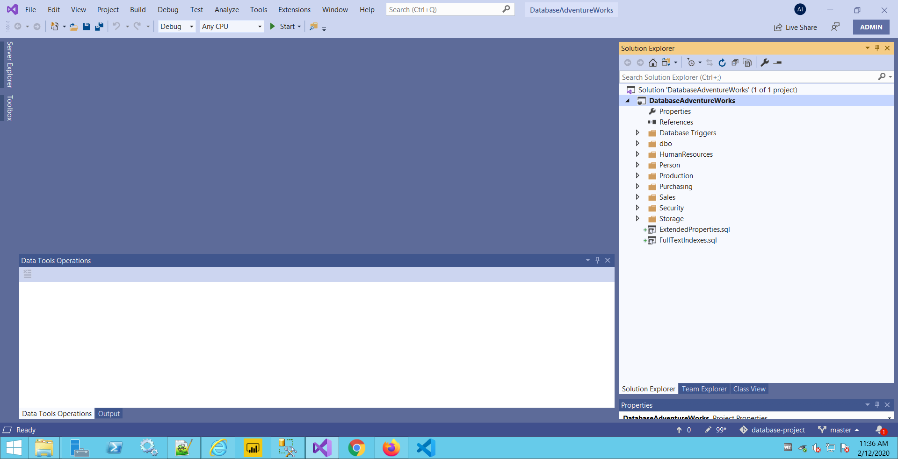

# Chapter 1

Steps:

1. Open SQL Server Manager Studio
2. Connect to Server
3. Click Right on Databases

4. Add mdf file of database

5. Open Visual Studio

6. Create A New Project

7. Search for Database Project

8. Click on Next

9. After Creating, Import Database 

10. Select Connection

11. Show Connection properties

12. And Then Complete with your credentials

13. Select with your Database

14. Click Ok and Wait for several minutes

15. When it's done ,click finish

16. On the right side you'll have database connection

17. Create a folder on your pc which is connected to your git 

18. Click right on your project and then click Add to Source Control

19. Click View on the top bar of Visual Studio

20. Click on Managing Connections

21. Select your repository on git

22. Then click on Changes

23. Add a specific comment

24. And then click Commit All

25. Click on the arrow that shows unpushed commit

26. And then click on push

